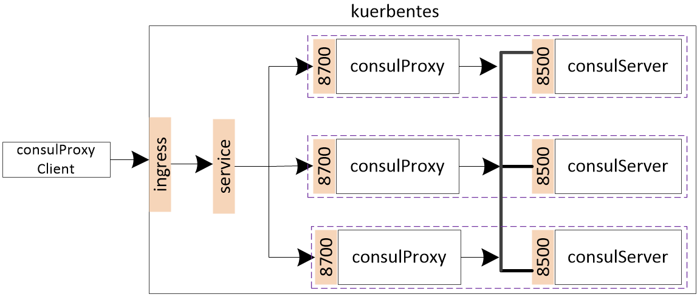

# ConsulHttpProxy
A proxy for handle consul services behind a load balance.

#### Install

`consulProxyClient` contains the proxy client，and `consulProxyServer` contains the proxy server.

If you use alpine image to build the docker image, use the command below:

```shell
# GOARCH=amd64 CGO_ENABLED=0 GOOS=linux go build -o consulProxyServer main.go
```

#### What is this tool work for?

When use load balance to register a service, the load balance will choice one consul server to store the service. When delete a service, the load balance may choice the wrong consul server according to the balance strategy.

#### WorkFlow

The work flow like below, consul proxy server works as a sidecar container with consul server. It will deliver the service `deregister` event to the right consul server.



#### constraint

- This tool used for `HTTP` scheme not `HTTPs`
- Pods should communicate with each other(eg overlay network)